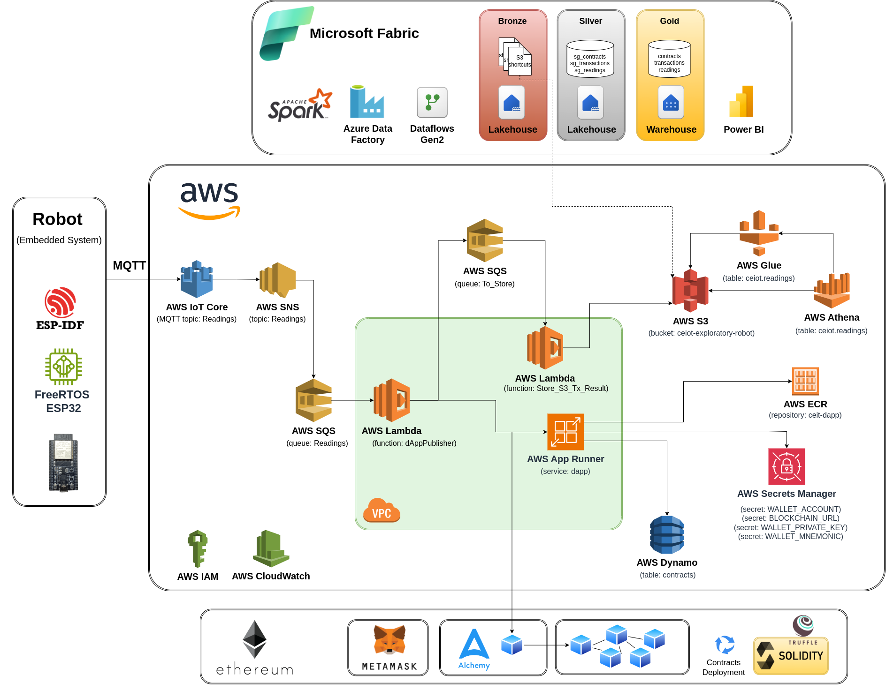

# Solución IoT para robot de exploracion ambiental con almacenamiento en blockchain
## Universidad de Buenos Aires - Facultad de Ingeniería
## Proyecto integrador 
- Carrera: Mestría en Internet de las Cosas
- Título del trabajo: Solución IoT para robot de exploracion ambiental con almacenamiento en blockchain
- Autor: Mg. Ing. Gonzalo Carreno

## Video demo del producto

## Documentación
- 
- 
- 
- 
- 

## Requerimientos funcionales

- Soporte para el envío en tiempo real de mediciones ambientales generadas por el robot.
- Soporte para la distribución y almacenamiento en blockchain de las mediciones ambientales transmitidas.
- Soporte para el procesamiento y almacenamiento de analíticas batch, tanto de las mediciones ambientales como de las transacciones registradas en la blockchain.
- Visualización en dashboards de BI de las métricas resultantes del procesamiento batch.

## Arquitectura de hardware del sistema

El hardware utilizado para la solución de IoT propuesta es un robot de exploración ambiental de control inalámbrico, desarrollado en la Carrera de Especialización en Sistemas Embebidos de la Universidad de Buenos Aires. A continuación  puede apreciarse una imagen del mismo y el repositorio de código del proyecto: 

## Arquitectura de software del sistema
La solución propuesta se compone de una arquitectura IoT distribuida y modular diseñada para capturar, procesar, almacenar y analizar mediciones ambientales generadas por un robot explorador conectado, integrando tecnologías de borde, nube y blockchain para garantizar trazabilidad, integridad y disponibilidad de los datos.
El sistema se estructura en cuatro grandes capas funcionales: percepción, procesamiento de eventos en tiempo real, almacenamiento y analítica avanzada, y visualización.

La arquitectura esta dividia en cuatro capas:
- Capa de Percepción
- Capa de Procesamiento de Eventos en Tiempo Real (Cloud Layer - AWS)
- Capa de Procesamiento Analítico y Backend (Microsoft Fabric)
- Capa de Visualización y Análisis (Power BI)

### Capa de percepción

La capa de percepción constituye el nivel más cercano al entorno físico dentro de la arquitectura IoT del sistema. Su función principal es capturar y digitalizar información ambiental proveniente del entorno de exploración mediante un conjunto de sensores integrados en un robot explorador autónomo.
Esta capa está implementada sobre un sistema embebido basado en ESP32, un microcontrolador de arquitectura dual-core con conectividad Wi-Fi y Bluetooth integrada, que actúa como nodo inteligente de adquisición y comunicación de datos.
 El desarrollo del firmware se apoya en el framework ESP-IDF y en el sistema operativo en tiempo real FreeRTOS, lo que permite una ejecución concurrente y eficiente de tareas, tales como la lectura de sensores, el procesamiento básico de datos y la gestión de comunicaciones.

#### Componentes principales de percepción
Sensor DHT11: encargado de medir la temperatura y humedad ambiental, proporcionando lecturas periódicas que son procesadas y formateadas por el microcontrolador.
Sensor BMP280: utilizado para la medición de presión atmosférica, contribuyendo a la caracterización del entorno físico y las condiciones meteorológicas.
Fotorresistor (LDR): mide la intensidad lumínica ambiental, permitiendo evaluar las condiciones de iluminación en el área de operación.

#### Conectividad y comunicación
El dispositivo ESP32 se comunica con el backend mediante el protocolo MQTT, estableciendo una conexión segura con el servicio AWS IoT Core. A través de este canal se publican los mensajes de telemetría con las mediciones capturadas, los cuales son posteriormente procesados, almacenados y distribuidos por las capas superiores del sistema.

#### Objetivo de la capa
La capa de percepción cumple el rol fundamental de sensar, formatear y transmitir los datos ambientales en tiempo real, sirviendo como punto de origen de la información que alimenta los procesos analíticos y de visualización de la plataforma.
 Su diseño modular, basado en estándares IoT y componentes de bajo consumo, asegura eficiencia energética, escalabilidad y confiabilidad operativa en entornos distribuidos.

### Capa de red

La capa de red actúa como el vínculo de comunicación entre los dispositivos de percepción en campo y la infraestructura de procesamiento en la nube. Su principal función es garantizar la conectividad, el transporte confiable de datos y la interoperabilidad entre el sistema embebido del robot explorador y los servicios de AWS.

Esta capa está basada en el uso del protocolo MQTT (Message Queuing Telemetry Transport), un estándar ampliamente adoptado en arquitecturas IoT por su bajo consumo de ancho de banda, eficiencia energética y mecanismo de publicación/suscripción, que permite una transmisión asíncrona y desacoplada de mensajes.
El dispositivo ESP32, actuando como cliente MQTT, establece una conexión segura hacia AWS IoT Core, que opera como broker central en la nube. La comunicación se realiza mediante TLS/SSL, garantizando la integridad y confidencialidad de los datos en tránsito.

#### Medios de conexión
Dependiendo del entorno operativo, el robot puede conectarse a Internet a través de diferentes medios de red:
Wi-Fi: utilizado en entornos controlados o de laboratorio, proporcionando conectividad directa y de baja latencia.
4G / 5G: empleados en escenarios de campo, permitiendo la operación remota y móvil del sistema, asegurando una transmisión continua de datos incluso fuera de redes locales.

#### Rol en la arquitectura
La capa de red cumple un papel esencial en el flujo de información en tiempo real, asegurando que las mediciones ambientales capturadas por los sensores sean publicadas eficientemente hacia AWS IoT Core, donde son enrutadas hacia los servicios de procesamiento y almacenamiento posteriores (SNS, SQS, Lambda, etc.).
Gracias al uso de MQTT sobre transporte IP, la comunicación entre el dispositivo embebido y la nube mantiene baja latencia, alta disponibilidad y tolerancia a desconexiones temporales, características clave en entornos IoT distribuidos.

### Capa de procesamiento de eventos cloud
Los datos publicados desde el robot son recibidos por AWS IoT Core, que los enruta hacia Amazon SNS para su distribución.
Desde SNS, los mensajes son consumidos por SQS, donde una función AWS Lambda los procesa e invoca una dApp desplegada en AWS App Runner.

Esta dApp interactúa con smart contracts desarrollados en Solidity y desplegados en la red Ethereum (vía Alchemy), los cuales registran las transacciones y eventos utilizando los logs de la blockchain para asegurar la trazabilidad.

La respuesta de la invocación es retornada a la función Lambda, que enriquece el mensaje original con los datos de la transacción y lo publica en una segunda cola SQS, desacoplando el flujo de persistencia.
Una segunda función Lambda toma estos mensajes y los almacena en formato estructurado en Amazon S3, donde están integrados los catálogos de AWS Glue y Athena, permitiendo la consulta directa mediante SQL sobre los datos históricos.

### Capa de procesamiento analítico en Microsoft Fabric

La siguiente imagen muestra la arquitectura lógica de integración entre las plataformas de AWS y Microsoft Fabric, enfocada en la interoperabilidad de datos y analítica unificada.

En el entorno de AWS, los datos se almacenan en Amazon S3, organizados en archivos accesibles mediante AWS Glue para catalogación y Amazon Athena para consultas interactivas.
Desde Microsoft Fabric, se establecen shortcuts directos hacia los archivos en S3, permitiendo acceder a los datos sin replicarlos, integrándolos dentro del ecosistema de Fabric.

En el entorno de Azure / Fabric, el flujo de procesamiento y análisis se compone de los principales servicios:
- Azure Data Factory (ADF) para la orquestación e ingestión de datos.
- Lakehouse, donde los datos se estructuran en capas bronze, silver y gold en formato Delta.
- Warehouse, que consolida la capa gold para su explotación analítica.
- Spark notebooks y Dataflows Gen2, que ejecutan procesos de transformación, limpieza y modelado de datos.
- Power BI, que consume los datos del warehouse y del lakehouse para generar visualizaciones y modelos semánticos interactivos.

Esta integración híbrida permite un flujo de datos fluido entre AWS y Microsoft Fabric, combinando la flexibilidad del almacenamiento en S3 con las capacidades analíticas y de gobierno de datos del entorno de Fabric.

La siguiente imagen representa el diagrama lógico del pipeline de datos implementado en Microsoft Fabric, que abarca el flujo completo desde la ingestión inicial hasta la capa analítica final.

El proceso comienza en la capa raw, donde se definen shortcuts hacia archivos almacenados en Amazon S3, permitiendo su acceso directo desde el entorno de Fabric sin necesidad de duplicar la información.
A continuación, en la capa Lakehouse, los datos son organizados y gestionados en formato Delta, siguiendo una estructura de capas:
- Bronze, que almacena los datos ingeridos con mínima transformación.
- Silver, donde los datos son curados, limpiados y estandarizados.
- Gold (Curated), que consolida los conjuntos de datos finales optimizados para el análisis.
Finalmente, los datos de la capa gold del lakehouse se replican hacia la capa Gold del data warehouse, desde donde se habilitan para su consumo en soluciones analíticas y modelos semánticos de Power BI.

La siguiente imagen muestra el data pipeline implementado en Azure Data Factory (ADF), diseñado para orquestar el proceso completo de curación y transformación de datos.

El flujo inicia con actividades Copy Data, que trasladan y normalizan la información desde la capa raw hacia la capa bronze, almacenándola en formato Parquet.
Posteriormente, se utilizan componentes Data Flow para realizar procesos de limpieza, estandarización y transformación de formato, asegurando la calidad y consistencia de los datos antes de su procesamiento avanzado.
A continuación, se integran notebooks de Spark, encargados de ejecutar transformaciones adicionales, enriquecimiento y generación de estructuras analíticas optimizadas en la capa gold dentro del data lakehouse.
Finalmente, las actividades Copy Data transfieren los conjuntos gold desde el lakehouse hacia la capa Gold del data warehouse, donde quedan disponibles para su consumo en herramientas analíticas y modelos semánticos de Power BI.

La siguiente imagen presenta el modelo relacional del modelo semántico de Power BI, compuesto por tres entidades principales. Estas entidades representan las fuentes de datos clave del sistema y están relacionadas entre sí mediante sus identificadores comunes. El diseño busca optimizar la consistencia, integridad referencial y eficiencia en las consultas analíticas dentro del entorno de Power BI.

### Capa de visualización en PowerBI

Finalmente, los datos consolidados y curados en el Fabric Warehouse son consumidos por Power BI, donde se han desarrollado un conjunto de dashboards interactivos que permiten el análisis de:
- Costos de transacciones en Ethereum (redes Sepolia y Holesky)
- Mediciones ambientales capturadas por los robots
- Distribución geográfica de las mediciones en territorio argentino
- Administración general de la plataforma y sus componentes

Los dashboards están respaldados por un modelo semántico unificado, y permiten a los usuarios realizar consultas dinámicas, comparaciones temporales y visualizaciones geoespaciales de los datos procesados.

## Consideraciones de diseño

El diseño de la presente arquitectura tiene los siguientes objetivos:
- Permitir la percepción, envío, procesamiento, distribución, almacenamiento, análisis y visualización de lecturas ambientales capturadas por el robot.
- Proveer un mecanismo ligero y eficiente para registrar mediciones ambientales en la blockchain.
- Garantizar que los datos sean auditables y confiables, utilizando los logs de eventos en lugar de almacenamiento on-chain para reducir costos de gas.
- Permitir un procesamiento analítico utilizando herramientas BigData de los datos almacenados.
- Permitir la explotación mediante reportes visuales de las métricas generadas.

### Diseño de la dApp

La dApp constituye la capa de aplicación encargada de interactuar con los smart contracts desplegados en Ethereum y exponer funcionalidades a otros componentes de la arquitectura mediante servicios web estandarizados.
 Está implementada en Node.js, utilizando la librería Web3.js para comunicarse con la blockchain y manejar transacciones de forma programática.

#### Componentes principales
- Web3.js: permite la conexión con los nodos de Ethereum (a través de Alchemy), la lectura y escritura de datos en los smart contracts y la gestión de transacciones, asegurando la integridad y trazabilidad de los eventos en la blockchain.
- Endpoints REST: la dApp expone sus funcionalidades mediante API REST, que son consumidas por funciones Lambda u otros servicios del backend.
- Swagger/OpenAPI: se utiliza para documentar los endpoints de la dApp, proporcionando una interfaz clara y estandarizada para la integración con otros módulos del sistema y facilitando la prueba de los servicios.

#### Funcionalidades principales
- Recepción de solicitudes desde la capa de eventos en tiempo real (AWS Lambda) para invocar transacciones en los smart contracts.
- Validación de los datos recibidos y formateo según el esquema requerido por los contratos inteligentes.
- Envío de transacciones a la blockchain y monitoreo del estado de ejecución a través de los logs y eventos emitidos por los smart contracts.
- Devolución de la respuesta a la función Lambda invocadora, incluyendo la información de la transacción en formato JSON, manteniendo la trazabilidad de la lectura original.
- 
#### Objetivos de diseño
- Garantizar interoperabilidad entre la blockchain y los servicios en la nube, desacoplando la lógica de smart contracts del backend principal.
- Proveer un punto de integración seguro y escalable que permita invocar contratos desde múltiples clientes o funciones serverless.
- Facilitar el desarrollo, prueba y mantenimiento mediante documentación automática y estandarizada de los endpoints con Swagger.
- Mantener la auditabilidad de las operaciones, asegurando que cada interacción con la blockchain esté registrada y pueda ser verificada posteriormente.

En la siguiente imagen se pueden apreciar los endpoints expuestos por la dApp:

### Diseño de los smart contracts

Los smart contracts constituyen la capa de registro y trazabilidad de mediciones ambientales en la blockchain de Ethereum, garantizando integridad, inmutabilidad y auditabilidad de los datos recolectados por los robots exploradores.

#### Estructura del contrato

El contrato EnvironmentalData2 está diseñado con las siguientes características:
- Estructura de datos (struct) EnvironmentalReading: define un registro de medición con los campos:
    - deviceId: identificador del robot emisor.
    - readingType: tipo de medición (temperatura, humedad, presión, luminosidad).
    - value: valor de la medición.
    - geoLat y geoLong: coordenadas geográficas del punto de medición.
    - date y time: fecha y hora de la lectura.

- Evento NewReading: cada vez que se registra una medición, el contrato emite un evento en la blockchain con todos los datos de la lectura. Esto permite que los sistemas externos (dApps, backends, funciones Lambda) puedan escuchar y reaccionar ante nuevos registros sin necesidad de consultar constantemente el estado del contrato.
- Función recordReading: es la función pública que permite registrar una nueva lectura. Al ser invocada, no almacena los datos en almacenamiento interno del contrato (para ahorrar gas), sino que emite el evento NewReading, asegurando que los datos queden inmutables en los logs de la blockchain.

### Despliegue de los contratos

Los contratos se despliegan utilizando Truffle, lo que facilita la migración a distintas redes y la integración con herramientas de desarrollo y testing como Ganache:
- Red de desarrollo local (Ganache): permite pruebas locales y simulación de transacciones antes de desplegar en redes reales.
- Redes de prueba (Sepolia y Holesky): la configuración de Truffle utiliza HDWalletProvider con la frase secreta de MetaMask y la URL RPC de cada red. Se definen parámetros como límite de gas, precio del gas, ID de red, y opciones para desactivar dry-run y listeners de confirmación, asegurando un despliegue confiable y controlado.
- La configuración soporta despliegue en múltiples entornos, garantizando que el mismo código pueda ejecutarse en redes locales o testnets públicas sin modificaciones.

En la siguiente imagen se puede apreciar la salida por consola del proceso de despliegue utilizando truffle:

Durante el despliegue se almacenan en AWS DynamoDB los ABI generados durante la compilación para permitir la invocación posterior desde la dApp. En la siguiente imagen se puede apreciar una perspectiva del despliegue:

